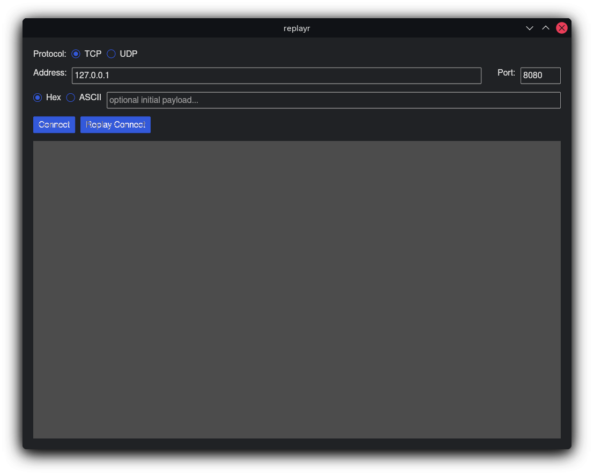
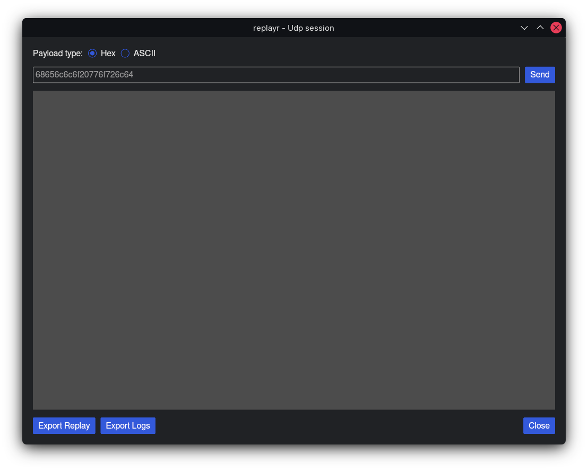
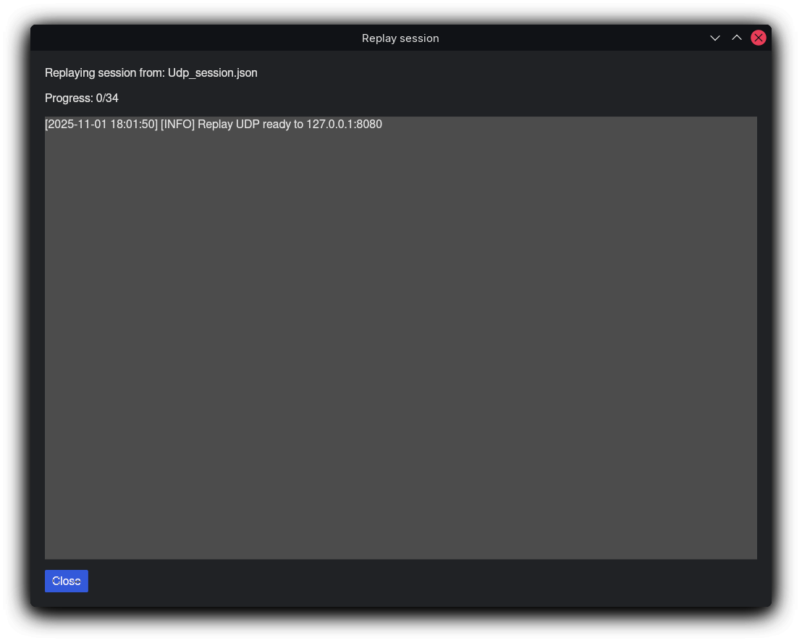

# replayr

A simple GUI application built with [iced](https://github.com/hecrj/iced)(cross-platform) for sending TCP and UDP packets with support for hex and ASCII payloads, session logging, and replay functionality so you dont have to do it all over again while debugging your backend.
Heavily inspired by [packet sender](https://packetsender.com/).

Only built and tested on Linux, but iced is supported on all major platforms, so there shouldn't be any issues.


I'm not a GUI guy, nor am I a professional Rust programmer, I just made this for myself and thought it might be useful to others.

## Features

- Send packets in hex or ASCII format to TCP or UDP servers
- Export session logs and replay sessions
- Multi-window interface for multiple connections
- Replay previously recorded sessions

## Images 






## Build Instructions

### Prerequisites

- [Rust](https://rust-lang.org/tools/install/)
- Cargo

### Building

1. Clone the repository:
   ```bash
   git clone https://github.com/Addemin94/replayr
   cd replayr
   ```

2. Build the project:
   ```bash
   cargo build --release
   ```

3. Run the application:
   ```bash
   cargo run --release
   ```

## Usage

1. Select protocol (TCP or UDP) in the main window.
2. Enter the server address and port.
3. Optionally, set an initial payload (for TCP).
4. Click "Connect" or "Open Session" to open a new session window.
5. In the session window, select hex or ASCII mode, enter your packet, and click "Send".
6. Use "Export Replay" to export the session so you can replay the inputs in another session, or "Export Logs" for logs.
7. Use "Replay Connect" to load and replay a saved session.

## Configuration

The application saves configuration (protocol, address, port, initial payload) to `config.toml` in the working directory.

## License

MIT License